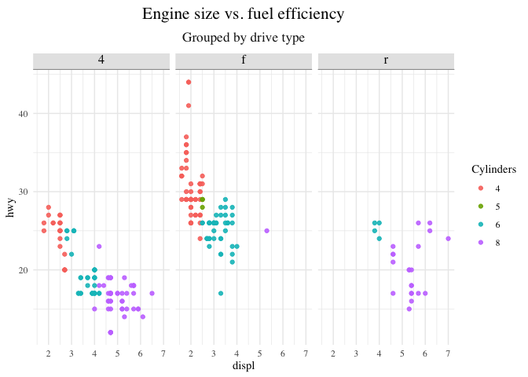
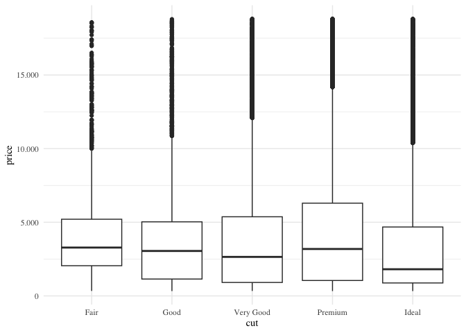

# pederlib2

Personal R package with utility functions for data analysis and
visualization.

## Installation

``` r
# install.packages("pak")
pak::pak("pedersebastian/pederlib2")
```

## Functions

### `startup()`

Loads tidyverse + readxl, sets ggplot2 geom defaults and applies
[`theme_pedr()`](https://pedersebastian.github.io/pederlib2/reference/theme_pedr.md)
in one call.

``` r
library(pederlib2)

startup(quiet = TRUE)
```

Pass `2` to also load tidymodels core packages:

``` r
startup(2)
```

### `theme_pedr()`

A clean ggplot2 theme based on `theme_minimal`, with centered titles,
styled facet strips and optional font.

``` r
library(ggplot2)

ggplot(mpg, aes(displ, hwy, color = factor(cyl))) +
  geom_point() +
  facet_wrap(vars(drv)) +
  labs(
    title = "Engine size vs. fuel efficiency",
    subtitle = "Grouped by drive type",
    color = "Cylinders"
  ) +
  theme_pedr(font_family = "serif")
```



### `komma()`

Norwegian number formatting for ggplot2 scales — comma as decimal mark,
period as thousands separator.

``` r
ggplot(diamonds, aes(cut, price)) +
  geom_boxplot() +
  scale_y_continuous(labels = komma()) +
  theme_pedr(font_family = "serif")
```



### `list_locale()`

Lists all locales available on the system.

``` r
head(list_locale(), 10)
#>  [1] "af_ZA"            "af_ZA.ISO8859-1"  "af_ZA.ISO8859-15" "af_ZA.UTF-8"     
#>  [5] "am_ET"            "am_ET.UTF-8"      "ar_AE"            "ar_AE.UTF-8"     
#>  [9] "ar_EG"            "ar_EG.UTF-8"
```
